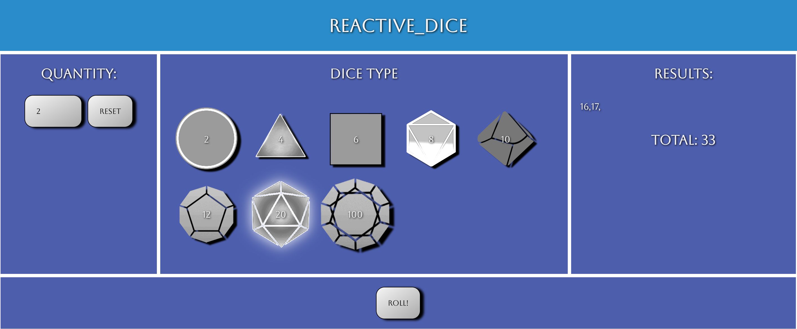

# RPG-Dice-Roller

RPG-Dice-Roller is an application for rolling polyhedral dice for tabletop rollplaying games.

## PICTURE OF WEBSITE

## TECHNOLOGIES USED
The application is built in [React](https://reactjs.org/), a [Javascript-based](https://www.javascript.com/) framework with integrated, [HTML](https://html.spec.whatwg.org/multipage/) and [CSS](https://www.w3.org/TR/CSS/),The app was published on [Netlify](https://rpg-dice-react.netlify.app/).

## WIREFRAME
The application was always planned to be a single-page web application; this wireframe was created in [Google Slides](https://www.google.com/slides/about/).

## PREVIOUS VERSION
This application was [originally built](https://github.com/Rancor38/rpg-dice-roller) in [Django](https://www.djangoproject.com/) but was refactored with React to create a sleek and responsive package.

## USER STORIES
As a user I’d like:
—  to be able to select a die and have the computer roll it for me.
— to select multiples of different kinds of dice and have the computer roll and add their results together.

## APPROACH TAKEN
[Bella](https://github.com/BellaMalo1) and [I](https://github.com/Rancor38) began this project to work in Django, and planned to build the application using their framework. We got started with user stories (see above) and built a wireframe in Google Slides to flesh out the concept. We collaborated with each other every step of the way using [Discord](https://discord.com/) to share screens remotely as well as [VSCode](https://code.visualstudio.com/) to pair-program with their liveshare feature.

I took it upon myself to refactor in React. I started by taking the work Bella and I had done in Django, and directly porting that into a react application, this was a decent start, but then the refactoring while [thinking in react](https://reactjs.org/docs/thinking-in-react.html) really went underway. It was challenging but satisfying to transform the app into functional components and the application is much more maintainable after the refactor.

[CLICK THIS LINK TO VISIT THE LIVE APP](https://rpg-dice-react.netlify.app/)